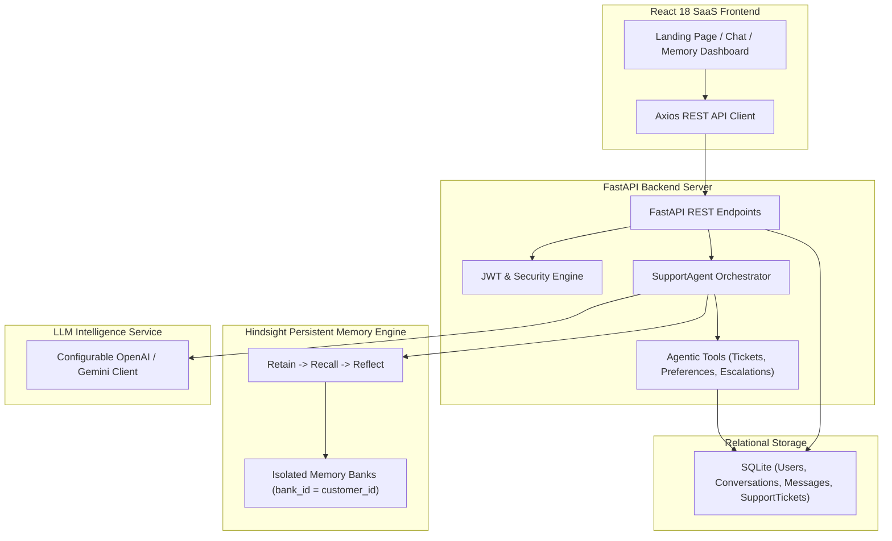

# MemoraSupport Architecture

## Overview
MemoraSupport is built on a modern 5-tier architecture separating application state, long-term memory, LLM reasoning, agent tool orchestration, and presentation.

## System Components

### 1. Application Database (SQLite)
Stores structured application metadata:
- **Users**: Authentication credentials (`email`, `password_hash`, `role`).
- **Conversations**: Customer session metadata (`id`, `customer_id`, `title`, `created_at`).
- **Messages**: Individual chat entries (`sender`, `content`, `memories_json`).
- **SupportTickets**: Escalated issues (`title`, `description`, `status`, `priority`).

### 2. Long-Term Customer Memory (Hindsight)
Hindsight acts as the persistent memory engine:
- **Bank Isolation**: Each customer has a unique recall boundary (`bank_id = f"customer_{customer_id}"`), guaranteeing Customer A cannot access Customer B's memories.
- **Retain**: Captures long-term facts (preferences, order IDs, delivery issues).
- **Recall**: Multi-strategy search (semantic similarity, keyword, temporal reasoning) returns top relevant memories for incoming customer requests.
- **Reflect**: Synthesizes query-focused memory summaries.

### 3. Agent Orchestrator & LLM Service
The `SupportAgent` coordinates incoming customer prompts:
1. Recalls relevant memories from Hindsight.
2. Injects memories into system prompt.
3. Invokes LLM provider (OpenAI or Gemini).
4. Extracts new long-term facts and saves them back to Hindsight via `retain_memory`.
5. Executes agentic tool actions (such as auto-opening support tickets for refunds or escalations).
