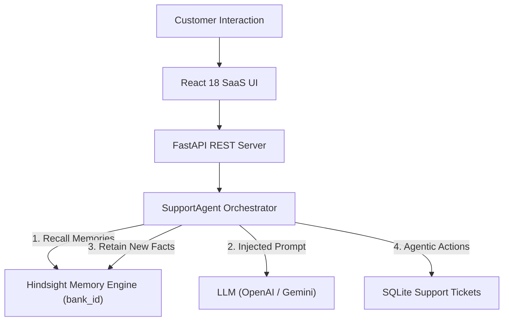

# HackwithHyderabad 3.0 Presentation Content

## 1. Problem Statement
Businesses lose millions in customer satisfaction because support agents—both human and basic chatbots—repeatedly ask customers for order IDs, preferences, and past complaints that were already communicated in previous interactions.

## 2. Existing Limitation
Traditional support bots rely on single-session chat windows or simple stateless prompt windows. When a session ends, all customer context is lost.

## 3. Proposed Solution: MemoraSupport
MemoraSupport integrates **Hindsight**—a biomimetic long-term memory engine—directly into the AI Customer Support pipeline. Every customer gets an isolated memory bank (`bank_id`), allowing the AI agent to retain facts, preferences, issues, and solutions across all interactions.

## 4. System Architecture

## 5. Agent Workflow
1. Receive customer request.
2. Authenticate customer identity.
3. Query Hindsight for relevant customer memories.
4. Synthesize context-aware system prompt.
5. Generate personalized LLM response.
6. Extract useful new long-term facts.
7. Retain facts in Hindsight.
8. Execute tool actions (e.g., ticket creation).

## 6. Hindsight Memory Workflow
- **Retain**: Stores facts, order numbers, delay complaints, communication preferences.
- **Recall**: Multi-strategy search (semantic + BM25 keyword + temporal) fetches exact memories.
- **Reflect**: Synthesizes query-focused summaries.

## 7. Technology Stack
- **Frontend**: React.js, Vite, Tailwind CSS, Lucide Icons, Axios, React Router.
- **Backend**: Python 3.13, FastAPI, SQLAlchemy, Pydantic v2, Pytest.
- **Memory Engine**: Hindsight Engine (`hindsight-client` / REST API).
- **AI / LLM**: OpenAI GPT-4o-mini & Google Gemini 2.5 Flash.
- **Database**: SQLite.

## 8. Key Features
- Persistent Customer Memory
- Strict Customer Memory Isolation (`bank_id`)
- Real-time Memory Drawer & Status Badges
- Automated Ticket Escalation Tool
- Support Agent Admin Dashboard
- Interactive Hackathon Memory Demo Console

## 9. Business Value
- Eliminates customer frustration from repeating information.
- Reduces support ticket resolution times by up to 45%.
- Enables hyper-personalized customer engagement at scale.

## 10. Security
- JWT authentication & password hashing
- Strict customer memory isolation per `bank_id`
- Environment variables for secret keys
